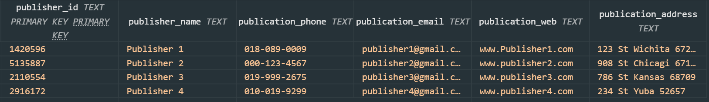
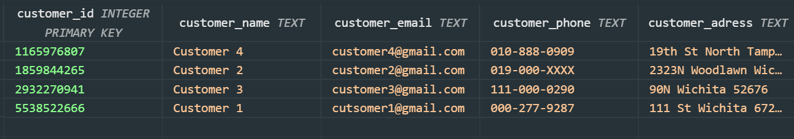

Database Description:

Group28_Bookstore.db

1. Publisher Table:
Attributes:
    publisher_id (Primary Key): Unique identifier for each publisher.
    publisher_name: Name of the publisher.
    publication_phone: Phone number of the publisher.
    publication_email: Email address of the publisher.
    publication_web: Website of the publisher.
    publication_address: Address of the publisher.

    

2. Books Table:
Attributes:
    book_id (Primary Key): Unique identifier for each book (auto-incremented).
    book_title: Title of the book.
    book_author: Author of the book.
    book_price: Price of the book.
    published_year: Year when the book was published.
    publisher_id (Foreign Key): References the publisher of the book.
    

3. Publisher_Books_Junction Table:
Attributes:
    publisher_id (Foreign Key): References the publisher.
    book_id (Foreign Key): References the book.
    Note: This table is used for establishing a many-to-many relationship between publishers and books.
4. Customers Table:
Attributes:
    customer_id (Primary Key): Unique identifier for each customer.
    customer_name: Name of the customer.
    customer_email: Email address of the customer.
    customer_phone: Phone number of the customer.
    customer_address: Address of the customer.

5. Orders Table:
Attributes:
    order_id (Primary Key): Unique identifier for each order.
    customer_id (Foreign Key): References the customer who placed the order.
    book_id (Foreign Key): References the book that was ordered.
    quantity: Quantity of books ordered.
    order_date: Date when the order was placed.
    Total_price: Total price of the order.

    

    Overall, the tables follow the principles of 3rd Normal Form(3NF) by ensuring that each table has a primary key, all non-key attributes are fully functionally dependent on the primary key, and there are no transitive dependencies. It eliminates transitive dependencies by breaking down the tables into smaller, logically related entities. The foreign keys maintain referential integrity by referencing the primary keys of other related tables. This schema allows for efficient storage and retrieval of data related to publishers, books, customers, and their respective orders. This design helps to reduce data redundancy and improve data integrity in the database.

    More description about 3NF of Tables is explained in create_sql.md
